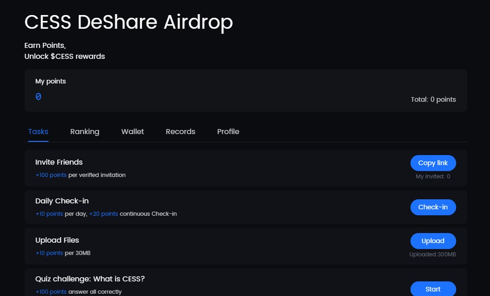

# AUTOMATION CESS + X với Selenium Python

## ⚠ Lưu ý quan trọng

🔴 **Dự án này có chứa code hint.** Vui lòng tìm đến **bài ghim** trong kênh [Telegram Channel](https://t.me/+8o9ebAT9ZSFlZGNl) để kiểm tra trước khi sử dụng.

---

## 📖 Mục lục
1. [Giới thiệu](#-giới-thiệu)
2. [Video demo](#-video-demo)
3. [Chức năng chính](#-chức-năng-chính)
4. [Yêu cầu ban đầu](#-yêu-cầu-ban-đầu)
5. [Cấu trúc file](#-cấu-trúc-file)
6. [Hướng dẫn cài đặt](#-hướng-dẫn-cài-đặt)
7. [Hướng dẫn sử dụng](#-hướng-dẫn-sử-dụng)
8. [Tùy chỉnh cấu hình](#-tùy-chỉnh-cấu-hình)
9. [Tips](#-tips)
10. [Thông tin liên hệ](#-thông-tin-liên-hệ)

## 🔔 Bật thông báo để theo dõi mã nguồn khi có update

1. Đăng nhập vào GitHub.
2. Nhấn vào biểu tượng 🔔 **Watch** (góc trên bên phải của repository này).
3. Chọn **"All Activity"** để nhận tất cả thông báo hoặc **"Custom" > "Pull Requests"** để nhận thông báo khi có thay đổi trong mã nguồn.

---

## 🌐 Giới thiệu

📌 **Trang dự án**: [cess.network](https://cess.network/deshareairdrop/?code=2190662)

<p align="center">
    
</p>

---

## 🎬 Video demo (cập nhật sau)

<p align="center">
    <a href="https://youtu.be/9N5ShN3AbSM">
        
    </a>
</p>

---


## 🚀 Chức năng chính

- **Đăng nhập X**: Tự động kiểm tra và đăng nhập tài khoản X.
- **Check-in và Retweet Daily**: Tự động click nhận point.

---

## 🔧 Yêu cầu ban đầu

- **Tài khoản X**: không có **Xác thực hai yếu tố**, mới thực hiện được auto login. Nếu không muốn, có thể tự login thủ công

---

## 📂 Cấu trúc file

| File                           | Mô tả                                    |
| ------------------------------ | ---------------------------------------- |
| `browser_automation.py`        | Code tự động hóa trình duyệt.            |
| `utils.py`                     | Các hàm hỗ trợ chung.                    |
| `cess.py`                      | Chương trình chính thực hiện automation. |
| `requirements.txt`             | Danh sách các thư viện cần thiết.        |
| `intro.jpg`                    | Hình ảnh giới thiệu.                     |

---

## 📌 Hướng dẫn cài đặt

### 1️ Tạo file `data.txt`

- Mỗi dòng chứa thông tin một profile theo cấu trúc:
  ```plaintext
  [tên_profile]|[email_x]|[username_x]|[password_x]|[proxy (tuỳ chọn)]
  ```

  Trong đó:

    - `tên_profile`: Tên của profile chrome.
    - `email_x`: email của tài khoản X.
    - `username_x`: username của tài khoản X.
    - `password_x`: mật khẩu đăng nhập tài khoản X.
    - `proxy (option)`: Có thể là một trong hai dạng sau:
      - `ip:port` → Proxy không có xác thực.
      - `user:pass@ip:port` → Proxy có xác thực bằng tài khoản & mật khẩu.

- Ví dụ:
  ```plaintext
  profile1|email1@gmail.com|username1|password1|38.154.227.167:2534             // Proxy (không yêu cầu mật khẩu)
  profile2|email2@gmail.com|username2|password2|user:pass@138.154.227.167:2534  // Proxy (yêu cầu mật khẩu)
  profile3|email3@gmail.com|username3|password3                                 // Không dùng proxy
  ```

- **Lưu ý:** Khi sử dụng proxy, trình duyệt có thể **hiển thị cảnh báo "Not Secure"** do vấn đề chứng chỉ bảo mật. Điều này không ảnh hưởng đến hoạt động, ae có thể bỏ qua. (Mình sẽ tìm cách fix sau).

### 2️ (Tùy chọn) Tạo file `token_tele.txt`

- Lưu **Telegram Bot Token** để chương trình gửi thông báo lỗi qua Telegram khi gặp sự cố.
- Nếu không có file này, ảnh lỗi sẽ lưu vào thư mục **snapshot**.
- File có cấu trúc:
  ```plaintext
  [Id_user]|[Id_bot:Token_bot_tele]
  ```
- Ví dụ:
  ```plaintext
  123456789|7934583453:AAFcOebukTPfkL6dfg4_PH_ahBA0lU36xyc
  ```

### 3️ Cài đặt Python & thư viện

Trước tiên, cần cài đặt Python (phiên bản 3.8 trở lên). Nếu chưa có, hãy tải và cài đặt từ [Python Official Site](https://www.python.org/downloads/).

- Kiểm tra phiên bản Python bằng lệnh:
  ```sh
  python --version
  ```
- Cài đặt thư viện yêu cầu:
  ```sh
  pip install -r requirements.txt
  ```

---

## ▶ Hướng dẫn sử dụng

### 1️ Chạy chương trình

```sh
python cess.py
```

Tuỳ chọn khác

```sh
# Bỏ qua menu, chạy tự động tất cả profile.
python cess.py --auto 

# Chạy tự động ở chế độ ẩn browser
python cess.py --auto --headless
```

### 2️ Các chế độ hoạt động

- **1. Set up**: Chạy chế độ cài đặt ban đầu và chọn profile.
- **2. Chạy Auto**: Chạy chế độ tự động theo cấu hình đã thiết lập.
- **3. Xoá profile**: Chọn xoá profile trong thư mục `user_data` (Nếu có).
- **0. Thoát**: Dừng chương trình.

**💡 Lưu ý:**

- **Lần đầu:** Chạy **Set up (1)**, để thiết lập cấu hình cần thiết.
- **Những lần sau:** Chạy **Auto (2)**, tự động thực thi theo luồng lập trình.

---

## ⚙ Tùy chỉnh cấu hình

### 🔹 **Thay đổi số lượng profile chạy đồng thời**

```python
browser_manager.run_terminal(
    profiles=PROFILES,
    max_concurrent_profiles=4,
    auto=args.auto,
    headless=args.headless
)
```

Đổi số `4` thành số bất kì

**Lưu ý:** Hầu hết trường hợp bị lỗi là do quá trình load chậm khi chạy nhiều profile cùng lúc. Tuỳ thuộc vào tài nguyên máy tính và tốc độ internet, hãy điểu chỉnh con số thích hợp.

---

## 🎯 Tips

### 1️ Tạo file token_tele.txt để theo dõi lỗi

- Mỗi dự án nên có một bot Telegram riêng, giúp theo dõi lỗi dễ dàng hơn.
- **Hướng dẫn lấy token Telegram:** Truy cập [channel](https://t.me/+8o9ebAT9ZSFlZGNl), tìm bài viết `Cách lấy thông tin cho file token_tele.txt`.

### 2️ Tự động hóa với một cú click (Chỉ áp dụng cho Windows)

Thay vì phải mở code, mở CMD và gõ lệnh, bạn có thể tạo một file `.bat` để chạy chương trình nhanh chóng. Dưới đây là cách thực hiện:

#### 🔹 Tạo file `.bat`

Tạo một file `.bat` với nội dung sau:

```
@echo off
cd /d [đường_dẫn_đến_thư_mục_cha_chứa_file.py]

REM Chạy script Python
[đường_dẫn_đến_file_môi_trường_python.exe] file.py --auto --headless
```

#### 🔹 Ví dụ cụ thể

Tạo file `demo.bat`, để thực thi file `demo.py` nằm bên trong thư mục `demo`.

📌 **Ví dụ 1: Chạy trực tiếp bằng Python trên hệ thống**
```
@echo off
cd /d G:\web-automation-selenium\demo

REM Chạy script Python
python demo.py --auto --headless
```

📌 **Ví dụ 2: Chạy bằng Python trong môi trường ảo**
```
@echo off
cd /d G:\web-automation-selenium\demo

REM Chạy Python trong môi trường ảo
G:\venv_selenium\Scripts\python.exe demo.py --auto --headless
```

### 3️ Chạy tự động bằng Windows Task Scheduler

1. Mở **Task Scheduler** bằng cách tìm kiếm trên Windows.
2. Nhấn **Create Basic Task** và đặt tên cho task.
3. Tab **Triggers**: chạy theo lịch
  - Click **New...**
  - Tại **Begin the task**: chọn **At startup** hoặc **On a schedule**.
4. Tab **Action**: thực thi code
  - Click **New..** 
  - Tại **Action**: chọn **Start a Program**.
  - Click **Browse...**: chọn file `.bat` đã tạo ở trên.
5. Click **Finish**, **Ok** để hoàn tất.

Bây giờ, chương trình sẽ tự động chạy theo lịch trình đặt trước mà không cần thao tác thủ công! 🚀

---

## 🔗 Thông tin liên hệ

📢 **Telegram Channel:** [Airdrop Automation](https://t.me/+8o9ebAT9ZSFlZGNl)

💰 **Ủng hộ tác giả:**

- **EVM:** `0x3b3784f7b0fed3a8ecdd46c80097a781a6afdb09`
- **SOL:** `4z3JQNeTnMSHYeg9FjRmXYrQrPHBnPg3zNKisAJjobSP`
- **TON:** `UQDKgC6TesJJU9TilGYoZfj5YYtIzePhdzSDJTctJ-Z27lkR`
- **SUI:** `0x5fb56584bf561a4a0889e35a96ef3e6595c7ebd13294be436ad61eaf04be4b09`
- **APT (APTOS):** `0x557ea46189398da1ddf817a634fa91cfb54a32cfc22cadd98bb0327c880bac19`

🙏 Khi ủng hộ, anh em không phiền có thể gửi token chính của mạng. Cám ơn anh em đã hỗ trợ!